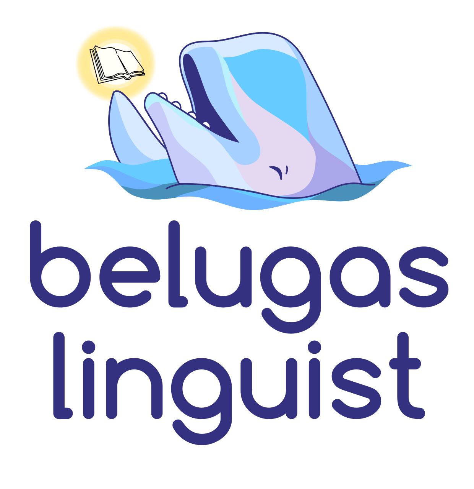

[](https://codeclimate.com/github/WhalesIL/belugas-linguist)
[](https://travis-ci.org/WhalesIL/belugas-linguist)

<p align="center">
  
</p>

## Overview

`belugas-linguist` is an engine used on the [Whales](https://github.com/WhalesIL/whales-cli) ecosystem to detect features, it's based on [Github Linguist](https://github.com/github/linguist) 

## Table of contents

- [Installation](#installation)
- [Usage](#usage)
- [Contributing](#contributing)
- [License](#license)

## Installation 

### Prerequisites

The Belugas Ruby CLI is distributed and run as a [Docker](https://hub.docker.com/r/icalialabs/belugas-linguist/) image, so you only need to have Docker [installed](https://docs.docker.com/engine/installation/) and running on your machine.

### Setup

Fire up your terminal and run: 

```console
docker pull icalialabs/belugas-linguist:latest
```

And that's it! 

## Usage

Here's where the magic begins, first of all in your terminal go to the project directory you want to analyze:

```console
cd code/path_to_project/
```

The project must be a git project, since linguist gets lots of information from git files. Once in the project, just execute the following command: 

```console
docker run \
  --interactive --tty --rm \
  --volume "$PWD":/code \
  icalialabs/belugas-linguist
```

And voilá! The terminal will stream a json output for each of the features detected in the following format:

```
[{
  "type": "feature",
  "name": "Ruby",
  "description": "The application uses Ruby code",
  "content": Content,
  "categories": ["Language"],
  "cue_locations": [all_files_from_ruby],
  "engines": ["github-linguist"],
  "meta": {
    "ratio": 0.5
    "total_files": 50
  }
},
{
  "type": "feature",
  "name": "CoffeeScript",
  "description": "The application uses Coffee",
  "content": Content,
  "categories": ["Language"],
  "cue_locations": [Location],
  "engines": ["github-linguist", "beluga-coffee"]
}
]
```

## Contributing

Everyone is freely to collaborate, just make sure you follow our [code of conduct](https://github.com/WhalesIL/belugas-linguist/blob/master/CODE_OF_CONDUCT.md). Thank you [contributors](https://github.com/WhalesIL/belugas-linguist/graphs/contributors)!

### Create an Issue

Find a bug and don't know how to fix it? Have trouble following the documentation or have a question about the project? Then by all means, please [create an issue](https://github.com/WhalesIL/belugas-linguist/issues/new).

Just please make sure you check [existing issues](https://github.com/WhalesIL/belugas-linguist/issues) to see if what you're running into has been addressed already.

### Submit a Pull Request

That's great! Just follow this steps:

1. Create a separate branch for your edits
2. Make sure your changes doesn't break the project by running your changes against current specs. **We love tests!** so it'll be even better if you create new ones when needed
3. Open your pull request against `master`

Once you've created a pull request, mainteners will chime in to review your proposed changes and to merged it if everything is right :tada:

### I want to contribute but don't know where to start

That's great also! We already have some [open issues](https://github.com/WhalesIL/belugas-linguist/issues) for you to dive in.

## Copyright

See [LICENSE](https://github.com/WhalesIL/belugas-linguist/blob/master/LICENSE.txt)


belugas-linguist is maintained by [Icalia Labs](http://www.icalialabs.com/team)
